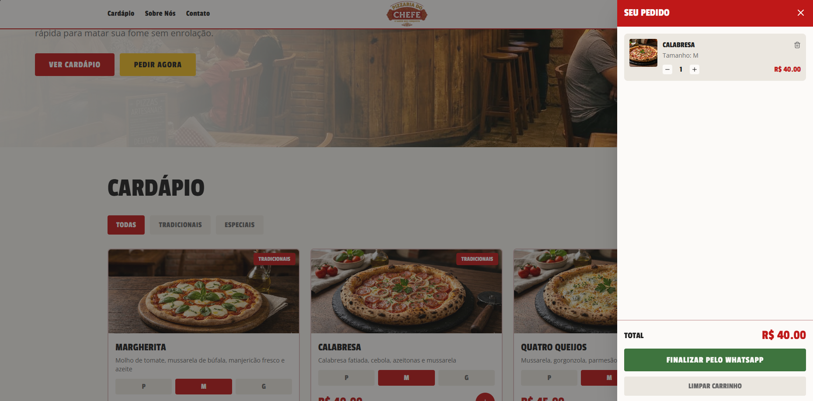

# Pizzaria do Chefe ‎𐂐◯𓇋

<p>
  
  
  
  
</p>

É um site de pizzaria desenvolvido para simular a experiência de pedido online, com foco em usabilidade, responsividade e organização de componentes no front-end.

---

#### ➜] Funcionalidades

- Cardápio interativo de pizzas
- Seleção de tamanhos
- Carrinho de compras dinâmico
- Finalização de pedidos via WhatsApp
- Interface moderna e totalmente responsiva

---

#### ➜] Objetivo do Projeto

Este projeto foi desenvolvido para praticar **desenvolvimento front-end moderno**, explorando:

- Componentização em **React**
- Tipagem com **TypeScript**
- Interface estilizada com **Tailwind CSS**
- Estrutura rápida de desenvolvimento com **Vite**
- Construção de uma **experiência de pedido realista para usuários**

---

#### ➜] Como executar o projeto

```bash
# Clonar o repositório
git clone https://github.com/seu-usuario/pizzaria-do-chefe

# Entrar na pasta do projeto
cd pizzaria-do-chefe

# Instalar dependências
npm install

# Rodar o projeto
npm run dev
```

---

#### ➜] Live Demo

https://pizzaria-do-chefe.vercel.app
---

#### ➜] Preview




---

<h2 align="center"> ────୨ৎ──── </h2>
